# Frontend Mentor - E-commerce product page solution

This is a solution to the [E-commerce product page challenge on Frontend Mentor](https://www.frontendmentor.io/challenges/ecommerce-product-page-UPsZ9MJp6). Frontend Mentor challenges help you improve your coding skills by building realistic projects.

## Table of contents

- [Overview](#overview)
  - [The challenge](#the-challenge)
  - [Screenshot](#screenshot)
  - [Links](#links)
- [My process](#my-process)
  - [Built with](#built-with)
  - [What I learned](#what-i-learned)
  - [Continued development](#continued-development)
  - [Useful Resources](#useful-resources)
- [Author](#author)

## Overview

### The challenge

Users should be able to:

- View the optimal layout for the site depending on their device's screen size
- See hover states for all interactive elements on the page
- Open a lightbox gallery by clicking on the large product image
- Switch the large product image by clicking on the small thumbnail images
- Add items to the cart
- View the cart and remove items from it

### Screenshot

#### General

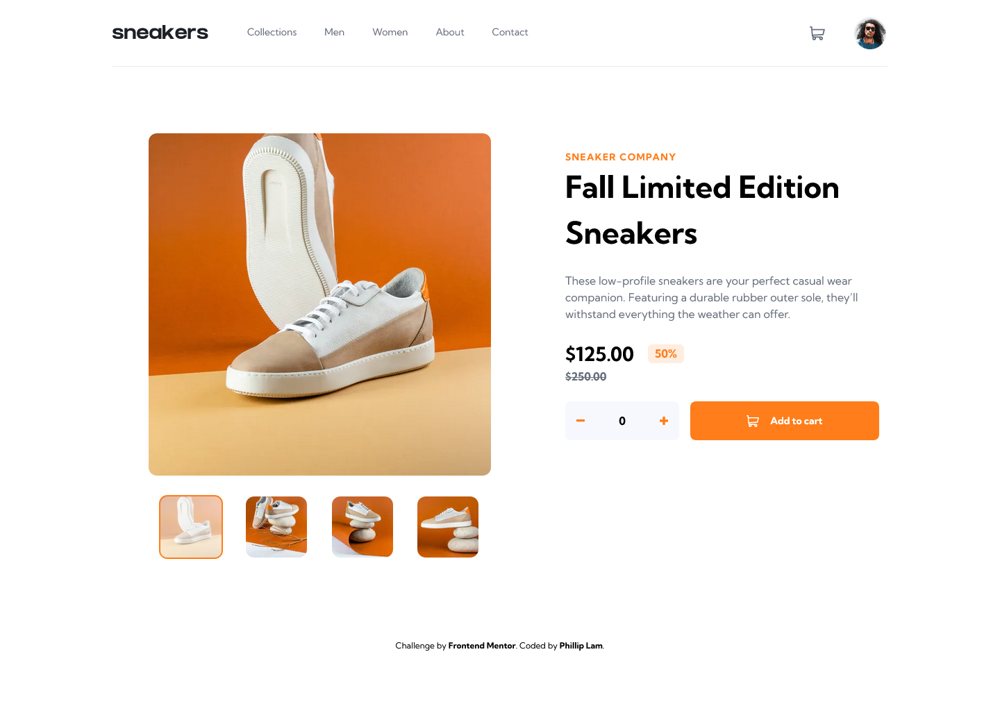


#### Carousel & Modal

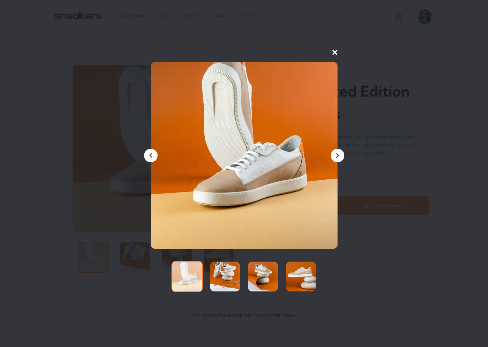

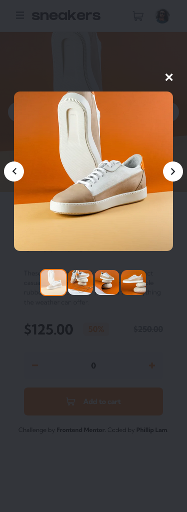

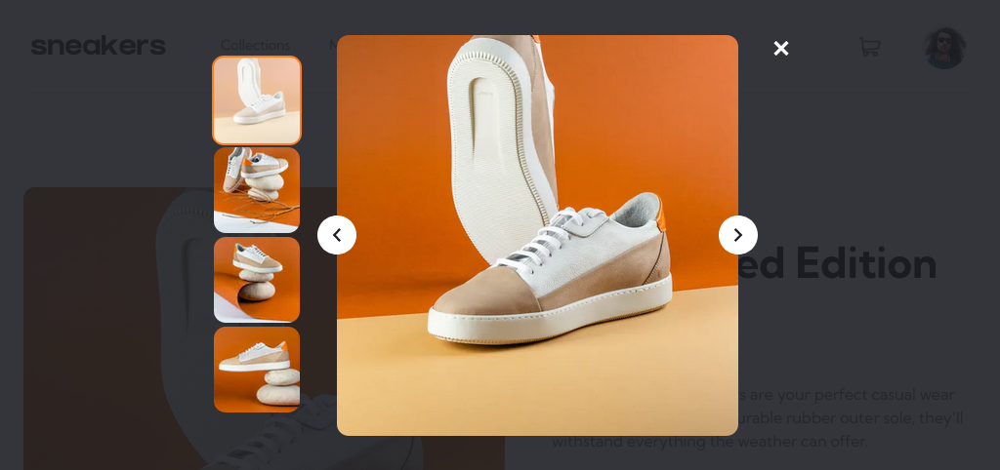

#### Shopping Cart

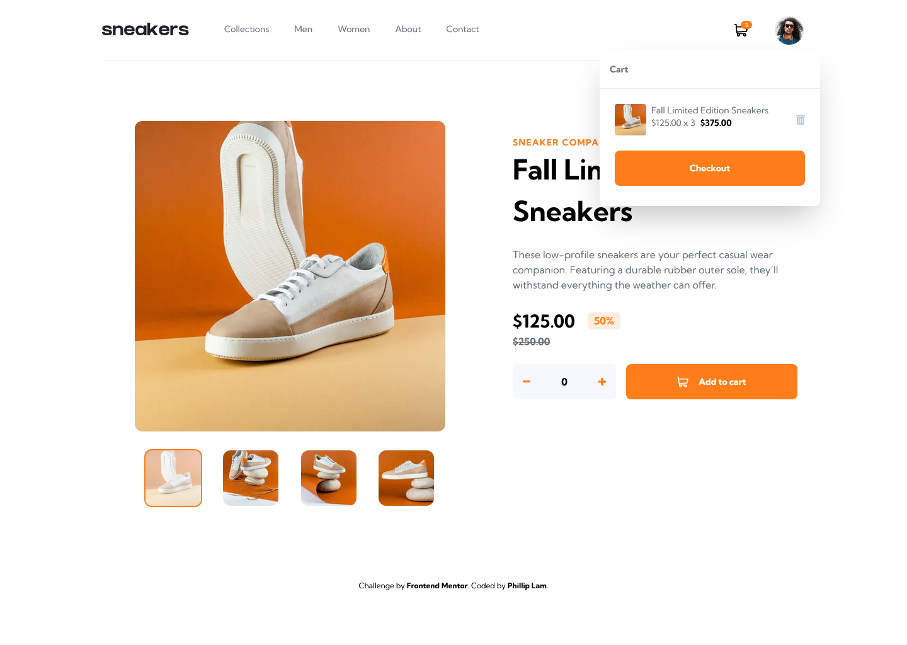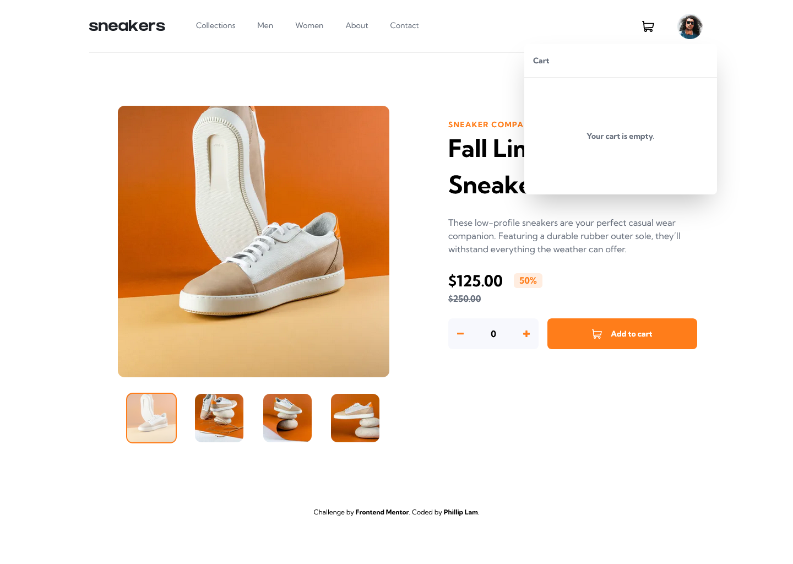

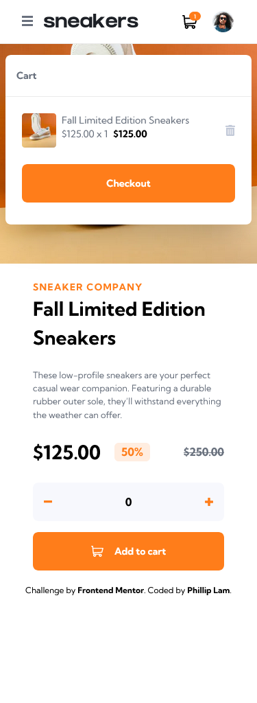

#### Hamburger Menu


#### (Extra) Dark Mode Theme Menu

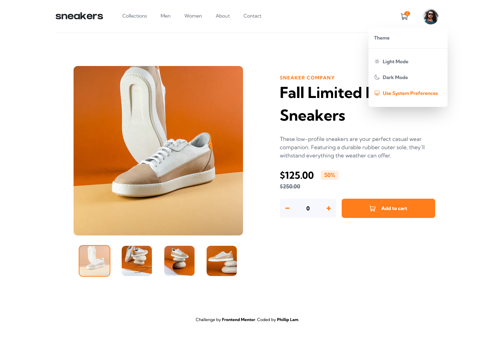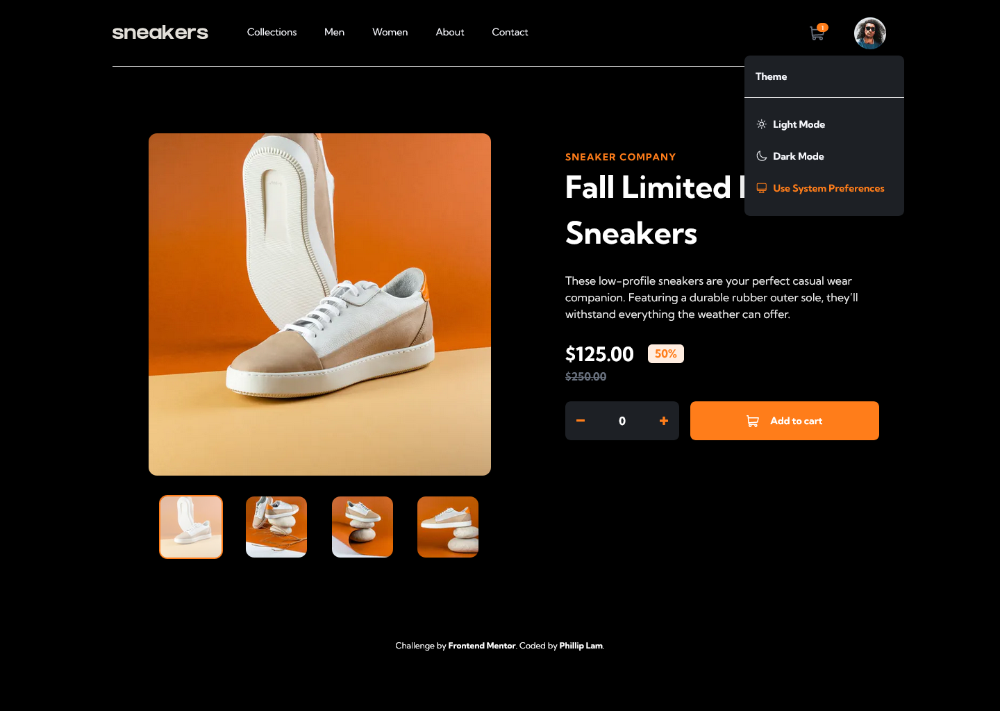

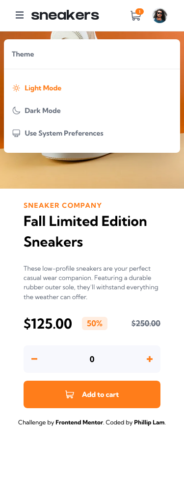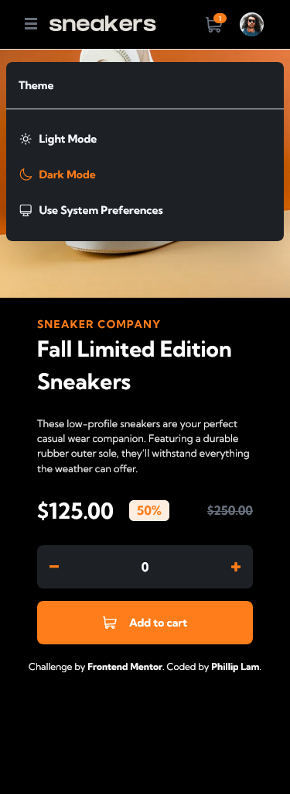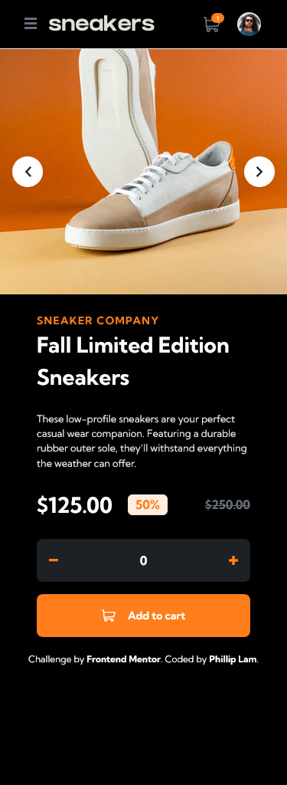

### Links

- Solution URL: [Frontend Mentor Submission](https://www.frontendmentor.io/solutions/ecommerce-product-page-with-react-nextjs-tailwindcss-27RD1hOy2V)
- Live Site URL: [https://ecommerce-product-page-app-challenge.vercel.app/](https://ecommerce-product-page-app-challenge.vercel.app/)

## My process

### Built with

- Semantic HTML5 markup
- CSS custom properties
- Flexbox
- CSS Grid
- Mobile-first workflow
- [React](https://reactjs.org/) - JS library
- [Next.js](https://nextjs.org/) - React framework
- [TailwindCSS](https://tailwindcss.com/) - For styles

### What I learned

This is my third Frontend Mentor challenge. Previously I had used MaterialUI components to help the frontend application, however this time I decided to build some of the core UI components from scratch, specifically: the carousel, modal carousel, hamburger menu, and backdrop overlay. When building these components, I realized that not all components need to be available to each other. Localizing scope to strictly necessary areas made it easier to manage the increasing number of components that were being created within the project directory. This meant I did not need to create a new file for every component. I could write a subcomponent inside of the main component function.

Also, while researching good design portfolio sites such as [Julia Johnson's personal portfolio page](https://github.com/juliacodes/JuliaCodesGatsby), I noticed that each component folder had its own `index` file. In previous projects I had simply used inline exports, however after doing some more digging, I realized that creating an `index.ts` file in each component folder to handle all imports and exports makes it easier and faster to find and re-use important components later on. In addition, imports look a lot cleaner. For example in my `Nav.tsx` component, I was able to import smaller components from the same folder without long pathnames.

```javascript
import { NavLinksDesktop, Hamburger, Avatar } from "./";
```

I will continue to use this index file method for future projects that have many components.

Another minor tad bit of insight that I learned from this project involves styling SVG files. As I was getting used to using the usual Tailwind classNames `bg-` or `text-` prefixes to quickly style and colour a component, I hit a roadblock when trying this on SVG elements. SVG components behave differently and can be styled by applying a [filter](https://developer.mozilla.org/en-US/docs/Web/SVG/Element/filter)

### Continued development

Currently the Dark Mode theme menu supports the user explicitly choosing the Light/Dark mode setting and/or choosing to use their OS setting. However currently there is a bug where the System Preferences option only changes the theme when the user clicks on the Menu option. When the user already has the System Preferences theme selected, and THEN updates their OS theme, the new theme is not honoured. I was not able to figure out how to handle this specific use case, but I hope to find a better solution in future projects.

### Useful resources

- [DEV.TO blog post on index files](https://dev.to/fahadaminshovon/-how-to-use-indexjs-fileproperly-302f)
- [Styling SVGs using filter effect](https://developer.mozilla.org/en-US/docs/Web/SVG/Element/filter)

## Author

- Frontend Mentor - [@philliplam8](https://www.frontendmentor.io/profile/philliplam8)
